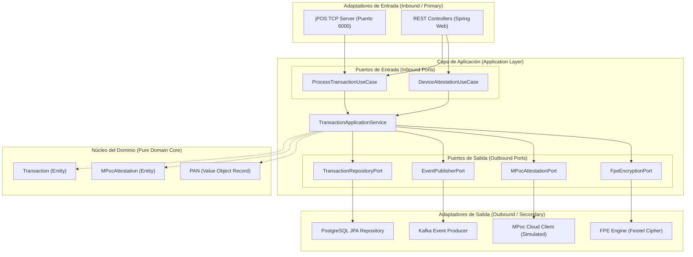

# Core SoftPOS (Tap-to-Phone) Backend Core

Este es el backend core de alta seguridad para una solución **SoftPOS (Tap-to-Phone)** que convierte dispositivos Android/COTS en terminales de pago, diseñado bajo los lineamientos del estándar **PCI MPoC (Mobile Payments on COTS)** y construido con **Java 21**, **Spring Boot 3.3.0**, **PostgreSQL**, **Apache Kafka** y **jPOS 2.0.4**.

---

## 🌟 Arquitectura y Diseño

El sistema utiliza **Arquitectura Hexagonal Estricta (Puertos y Adaptadores)** para aislar completamente las reglas de negocio y el dominio financiero de la persistencia, mensajería e infraestructura técnica, dividiéndose en tres capas claras:

1. **Capa de Dominio (`domain`)**: Contiene únicamente las entidades de negocio (`Transaction`, `MPocAttestation`) y objetos de valor (`PAN`). No tiene acoplamiento ni interfaces de puertos.
2. **Capa de Aplicación (`application`)**: Define los puertos de entrada (casos de uso), puertos de salida (interfaces hacia bases de datos y sistemas externos) y el servicio orquestador (`TransactionApplicationService`).
3. **Capa de Infraestructura (`infrastructure`)**: Implementa los adaptadores técnicos específicos (jPOS TCP Server, REST Controllers, bases de datos PostgreSQL, Apache Kafka).

### Diagrama Arquitectónico



---

## 🌊 Flujo Transaccional en un Caso Real

Para comprender en detalle cómo interactúan el celular del comercio (Tap-to-Phone), la tarjeta de crédito física por NFC, nuestro backend hexagonal, el módulo HSM y las redes de adquirencia (Visa/Mastercard) en un cobro físico real, consulta nuestra guía interactiva:

👉 **[Guía de Flujo en Caso Real y Producción](file:///d:/Danny/Projects/Apex/Tap%20to%20Phone%201/taptotphone/docs/02_real_world_flow.md)**

Esta guía incluye diagramas de secuencia detallados de:
1. **Atestación MPoC (PCI Mobile Payments on COTS)** de dispositivo móvil.
2. **Lectura NFC y Captura de Datos (EMV L2 Contactless Card Tap)**.
3. **Flujo Financiero Completo End-to-End** (Celular -> Backend SoftPOS -> HSM -> Red de Tarjetas -> Banco Emisor).
4. **Procesamiento Post-Transaccional Asíncrono** mediante tópicos de Kafka.

---


## 🔒 Seguridad y Cumplimiento PCI DSS / MPoC

Para cumplir rigurosamente con los estándares de seguridad de datos de la industria de tarjetas de pago (PCI DSS) y MPoC, se implementan tres niveles de defensa críticos:

### 1. Cifrado FPE (Format-Preserving Encryption)
Para no romper integraciones con sistemas legacy y a la vez no almacenar el PAN (Primary Account Number) en texto plano, implementamos un **Cifrado que Preserva el Formato**.
- **BIN y Last4 en Claro**: Se conservan los primeros 6 dígitos (BIN para ruteo de red) y los últimos 4 dígitos intactos.
- **Red Feistel de 4 rondas con AES**: Los 6 dígitos centrales (rango de `000000` a `999999`) son tratados como un número en base 1000 dividido en dos bloques de 3 dígitos (L y R). A través de 4 rondas Feistel con AES-ECB como función pseudo-aleatoria, se cifran en otro número de 6 dígitos.
- **Resultado**: La base de datos almacena una tarjeta cifrada de 16 dígitos numéricos que mantiene el formato original y pasa las validaciones de negocio básicas, pero el PAN real de tarjeta está completamente oculto y protegido.

### 2. Atestación Remota de Dispositivos (PCI MPoC)
Antes de que un dispositivo tap-to-phone pueda procesar una transacción, realiza una atestación remota en la nube para verificar:
- La integridad física y lógica del dispositivo (detección de ROOT, depuradores activos, emuladores o alteraciones del kernel).
- El estado de las claves seguras NFC administradas vía HCE (Host Card Emulation).
- Firma del reporte criptográfico por un validador en la nube aislado.

### 3. Hilo de Ejecución Ultraliviano (Virtual Threads - Project Loom)
Habilitado de forma nativa en `application.yml` (`spring.threads.virtual.enabled: true`). Permite que el servidor embebido jPOS atienda miles de conexiones TCP concurrentes provenientes de dispositivos móviles sin agotar el pool de hilos de la plataforma (Platform Threads), asignando un hilo virtual liviano por transacción.

---

## 🛠️ Tecnologías y Dependencias

- **Lenguaje**: Java 21 (Records, Pattern Matching, Virtual Threads)
- **Framework**: Spring Boot 3.3.0 (Jakarta EE namespaces)
- **Motor Financiero**: jPOS 2.0.4 (Canal ASCII TCP, MUX de canal por Campo 41)
- **Base de Datos**: PostgreSQL 15-alpine (Cifrado de datos sensibles)
- **Mensajería**: Apache Kafka (Event-driven streaming)
- **Contenedores**: Docker y Docker Compose (Multi-stage builds)

---

## 🚀 Guía de Compilación y Despliegue

### Requisitos Previos
- JDK 21 instalado localmente.
- Maven 3.8+ instalado localmente (o uso de `./mvnw`).
- Docker y Docker Compose en funcionamiento.

### 1. Compilación Local
Para compilar el proyecto y empaquetar el JAR sin levantar contenedores, ejecuta:
```bash
mvn clean package -DskipTests
```
Para ejecutar las pruebas unitarias integradas (que verifican el cifrado FPE, la validación Luhn y la inicialización del contexto):
```bash
mvn test
```

### 2. Despliegue con Docker Compose (Producción-Listo)
Desde la raíz del proyecto, ejecuta el siguiente comando para levantar el core de la aplicación, PostgreSQL con base de datos persistente y Kafka:
```bash
docker-compose up --build -d
```
Este comando construirá la imagen del backend usando un `Dockerfile` multi-etapa optimizado y levantará:
- **Base de Datos**: PostgreSQL en el puerto `5432` con usuario `postgres` y contraseña `postgrespassword`.
- **Kafka**: Broker escuchando localmente en el puerto `9092`.
- **Backend App**: Expone la API REST en el puerto `8080` y el servidor TCP jPOS en el puerto `6000`.

---

## 🧪 Pruebas de Integración y Validación

Ofrecemos un flujo completo de pruebas manuales y simulaciones TCP. Para facilitar la validación a través de herramientas visuales, hemos creado una colección oficial de Postman con todos los endpoints preparados para su importación inmediata:

👉 **[Colección Oficial de Postman (JSON)](file:///d:/Danny/Projects/Apex/Tap%20to%20Phone%201/taptotphone/docs/postman_collection.json)**

Puedes importar directamente este archivo `postman_collection.json` en Postman para ejecutar las solicitudes de atestación y cobro de manera instantánea.

### 1. Atestación de Dispositivo (PCI MPoC)
Antes de transar, el dispositivo SoftPOS debe solicitar validación. Envía una petición REST:

**Petición:**
- **URL**: `POST http://localhost:8080/api/v1/attestation/verify`
- **Body (JSON)**:
```json
{
  "terminalId": "TRM00001",
  "deviceHardwareId": "ARM64-SECURE-CHIP-99A82D",
  "hceToken": "SECURE_HCE_TOKEN_EXP_2026"
}
```

**Respuesta Exitosa (HTTP 200):**
```json
{
  "id": "e427d142-ffde-44b4-824a-9b4ad13426b3",
  "terminalId": "TRM00001",
  "deviceHardwareId": "ARM64-SECURE-CHIP-99A82D",
  "attestationStatus": "TRUSTED",
  "attestationDateTime": "2026-05-22T20:25:21Z",
  "signature": "7d983412ab...SECURE-MPOC-SIG"
}
```

---

### 2. Simulación de Transacción TCP (ISO 8583 via jPOS)
Hemos creado un cliente interactivo y autónomo para probar la mensajería financiera real.

Puedes ejecutar el simulador desde tu IDE o la consola ejecutando la clase test:
```bash
mvn test-compile
mvn exec:java -Dexec.mainClass="danny.com.taptotphone.client.IsoClientSimulator" -Dexec.classpathScope="test"
```

**Flujo del Simulador:**
1. Abre un Socket TCP al puerto `6000` del backend.
2. Construye un mensaje ISO-8583 `0200` (Solicitud de Autorización de Compra) con un PAN real Visa (`4111112222213333`) y monto `$150.00` (Campo 4: `000000015000`).
3. Envía el mensaje mediante `ASCIIChannel`.
4. El backend recibe, parsea los campos utilizando el Campo 41 (Terminal ID) como clave MUX, aplica el cifrado FPE sobre los dígitos centrales, guarda en PostgreSQL, publica el evento en Kafka, y responde al simulador con un mensaje `0210` aprobado (Campo 39: `00` y código de autorización en Campo 38).
5. El simulador imprime la respuesta decodificada detalladamente.

---

### 3. Pruebas Transaccionales vía API REST
Puedes forzar el procesamiento de una transacción desde una petición REST directa (simulando peticiones internas de pasarelas alternativas):

**Petición:**
- **URL**: `POST http://localhost:8080/api/v1/transactions/process`
- **Body (JSON)**:
```json
{
  "pan": "4111112222213333",
  "amount": 250.00,
  "currency": "840",
  "merchantId": "MERCH0000000001",
  "terminalId": "TRM00001",
  "stan": "999888"
}
```

**Respuesta Exitosa (HTTP 200):**
```json
{
  "id": "e15c4d32-cd2b-426b-88a2-f81d11ff9288",
  "maskedPan": "411111******3333",
  "amount": 250.00,
  "currency": "840",
  "status": "APPROVED",
  "responseCode": "00",
  "approvalCode": "582910",
  "terminalId": "TRM00001",
  "merchantId": "MERCH0000000001",
  "processedAt": "2026-05-22T20:25:17Z"
}
```

---

### 4. Consulta de Historial Transaccional Seguro
Para comprobar la persistencia y la visibilidad de datos sensibles:

- **URL**: `GET http://localhost:8080/api/v1/transactions`

**Respuesta:** Retorna el listado completo. Observarás que el PAN real **nunca se expone**. Solo se devuelve de forma enmascarada (`411111******3333`), mientras que a nivel de base de datos se guarda bajo el cifrado reversible FPE.

---

## 💾 Estructura de Base de Datos y Logs

### Consulta SQL en la Tabla `transactions`
Si realizas un query `SELECT id, masked_pan, encrypted_pan, amount, status FROM transactions;` sobre PostgreSQL, observarás el siguiente comportamiento seguro:

| id | masked_pan | encrypted_pan | amount | status |
| :--- | :--- | :--- | :--- | :--- |
| `UUID-Value` | `411111******3333` | `4111111827363333` | `150.00` | `APPROVED` |

- **`masked_pan`**: Versión segura para consultas públicas y vistas web.
- **`encrypted_pan`**: Versión cifrada de preservación de formato (el PAN cifrado `4111111827363333` reemplaza los dígitos reales centralizados `222222` por `182736` usando una clave criptográfica de 256 bits).

*¡Ningún log del sistema emite datos sensibles de tarjeta (PAN) en texto claro, cumpliendo cabalmente con las normas PCI DSS!*
