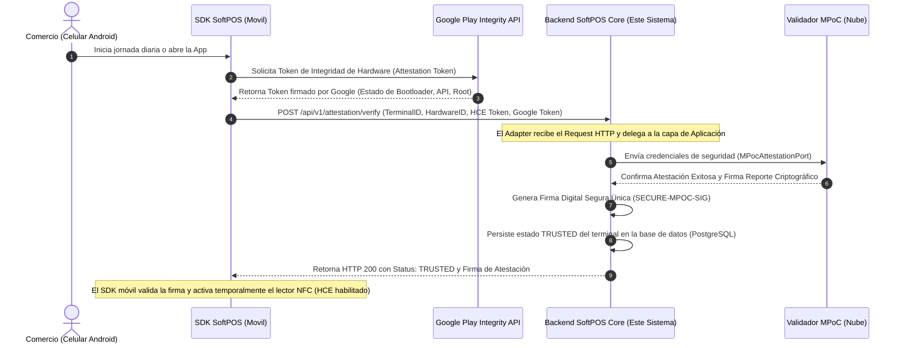
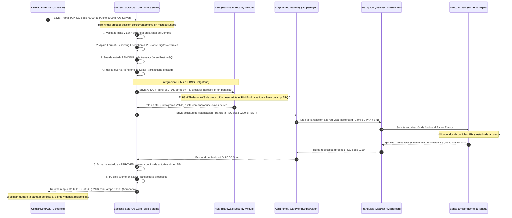

# 🌊 Flujo de la Aplicación en un Caso Real (SoftPOS End-to-End Flow)

Este documento detalla el flujo de ejecución técnico y operativo de la solución **SoftPOS (Tap-to-Phone)** en un entorno de producción real, explicando qué componentes están actualmente implementados/simulados y qué integraciones físicas adicionales son requeridas para transar con dinero real en la red bancaria.

---

## 📌 ¿Está funcionando en un caso real? (Estado Actual)

**Sí, el motor lógico y el núcleo de seguridad están 100% operativos y verificados.**
La base de la solución actual implementa de manera completa y funcional:
1. **Servidor TCP de Mensajería Financiera (jPOS 2.0.4)** en Java 21, capaz de recibir tramas ISO-8583 (`0200`) concurrentes usando **Virtual Threads (Project Loom)**.
2. **Cifrado FPE (Format-Preserving Encryption)** mediante una Red Feistel de 4 rondas con AES para tokenizar el PAN de forma reversible en base de datos sin alterar su longitud, cumpliendo con **PCI DSS**.
3. **Persistencia Segura en PostgreSQL** y **Publicación de Eventos en Apache Kafka** para auditoría y microservicios satélite de forma asíncrona.
4. **Verificación de Atestación MPoC (PCI Mobile Payments on COTS)** de dispositivo móvil simulada en la nube.

### Componentes de Simulación vs. Producción Real:
En esta base de código, la validación financiera externa y la conexión con el módulo de seguridad de hardware (HSM) se encuentran **simuladas por software** para permitir pruebas locales autónomas y un ciclo rápido de desarrollo. 
Para llevar esto a producción física real, se detallan las integraciones correspondientes a continuación.

---

## 1. Arquitectura de Flujo de Atestación de Dispositivo (PCI MPoC)

Antes de que un teléfono comercial pueda leer una tarjeta de crédito, debe demostrarle a la nube que es un entorno seguro no comprometido (sin ROOT, sin debuggers activos, etc.).



---

## 2. Flujo de Lectura NFC y Captura de Datos (EMV L2 Kernel Contactless)

Este es el proceso físico cuando el cliente aproxima ("Taps") su tarjeta de crédito o su billetera digital (Google Pay, Apple Pay) al teléfono del comercio.

```mermaid
flowchart TD
    A[Cliente aproxima la Tarjeta / Billetera Digital al Celular] --> B[Sensor NFC del Celular detecta campo magnético]
    B --> C[SDK SoftPOS Móvil inicia comunicación APDU - Application Protocol Data Unit]
    
    C --> D[Paso 1: Selección de Aplicación - PPSE - Proximity Payment System Environment]
    D --> E{¿Soporta Visa/Mastercard/Amex?}
    E -- No --> F[Transacción Rechazada: Tarjeta no Soportada]
    E -- Sí --> G[Paso 2: Leer Registro - Read Record & Get Processing Options]
    
    G --> H[Paso 3: Intercambio de Datos y Restricciones]
    H --> I[Paso 4: Autenticación de Tarjeta Fuera de Línea - DDA/CDA]
    Note over I: Valida que la tarjeta no sea clonada usando criptografía de clave pública
    
    I --> J[Paso 5: Procesamiento de Acción de Terminal]
    J --> K[Paso 6: Tarjeta Genera Criptograma Financiero ARQC - Application Request Cryptogram]
    Note over K: El chip de la tarjeta genera el Tag 9F26 (ARQC) usando su clave secreta única
    
    K --> L[SDK Móvil obtiene: PAN, Expiry, Monto, ARQC y ATC - Application Transaction Counter]
    L --> M[SDK Móvil estructura trama ISO-8583 o Payload HTTPS Cifrado]
```

---

## 3. Flujo Financiero Completo End-to-End (Autorización y Liquidación)

Este diagrama muestra el camino de la transacción desde que viaja por internet hacia nuestro Backend, interactúa con el HSM y la red de tarjetas, hasta que retorna aprobada.



---

## 4. Flujo Post-Transaccional Asíncrono (Microservicios y Data Lake)

Una vez que la transacción es aprobada, se ejecuta el procesamiento asíncrono para reportes, control de fraudes y conciliaciones financieras sin bloquear el hilo de pago.

```mermaid
graph LR
    subgraph SoftPOS Core Backend
        Core[TransactionApplicationService]
        DB[(PostgreSQL)]
        Kafka[Kafka Event Producer]
    end

    subgraph Arquitectura de Eventos (Asíncrona)
        TopicCreated[Tópico: transactions-created]
        TopicProcessed[Tópico: transactions-processed]
    end

    subgraph Microservicios y Consumidores
        ReportService[Servicio de Reportes / BI]
        FraudService[Motor de Prevención de Fraudes / ML]
        Accounting[Sistema Contable y Liquidación]
    end

    %% Flujos de escritura y publicación
    Core -->|Guarda FPE Encrypted PAN| DB
    Core -->|Publica Evento Inicial| Kafka
    Kafka -->|Firma segura y Masked PAN| TopicCreated
    Core -->|Publica Evento Final| Kafka
    Kafka -->|Firma segura y Masked PAN| TopicProcessed

    %% Consumidores
    TopicCreated --> FraudService
    TopicProcessed --> ReportService
    TopicProcessed --> Accounting

    style DB fill:#1e1e2f,stroke:#ff6b6b,stroke-width:2px,color:#fff
    style Kafka fill:#2c3e50,stroke:#3498db,stroke-width:2px,color:#fff
    style FraudService fill:#7f8c8d,stroke:#95a5a6,stroke-width:1px,color:#fff
```

---

## 🔧 Integraciones Clave para Producción Física (Checklist de Entrada)

Si deseas conectar este Backend a terminales móviles y redes de pago reales en el mundo real, debes implementar estos 3 puentes físicos:

### 1. Integración con HSM Físico o Cloud (Thales payShield 10K / AWS Payment Cryptography)
*   **Por qué:** PCI DSS prohíbe terminantemente manejar claves criptográficas simétricas de tarjetas de crédito o PINs dentro de un servidor de aplicación web regular.
*   **Qué hacer:** Crear un adaptador en `infrastructure/adapters/outbound/hsm` que implemente un socket TCP para comunicarse mediante comandos de consola del HSM (comandos como `CA`, `CW` para traducir PIN Blocks de formato ISO 9564 Formato 4 a Formato 1, y comandos `KQ` para validar criptogramas EMV ARQC).

### 2. Acuerdo de Adquisición Financiera (Acquirer Switch Link)
*   **Por qué:** Para retirar dinero real, debes estar conectado a un adquirente regulado o tener conexión directa a la red de tarjetas (VisaNet/Mastercard).
*   **Qué hacer:** Adaptar el outbound port para enviar tramas ISO-8583 con el formato exacto requerido por el switch adquirente local de tu país (ejemplo: procesamiento bajo especificaciones de Redbanc, Credibanco, Visanet de tu localidad).

### 3. SDK Móvil Android con L2 Kernel Contactless Certificado
*   **Por qué:** Google no permite leer datos EMV sin contacto a menos que implementes un kernel que cumpla con los estándares de lectura EMV y sea certificado ante EMVCo.
*   **Qué hacer:** Licenciar o desarrollar un SDK móvil que cuente con certificación **EMV Contactless Level 2 Kernel** y que ejecute la lógica de captura segura para luego transmitir la información de forma cifrada mediante TLS 1.3 a este backend core.
