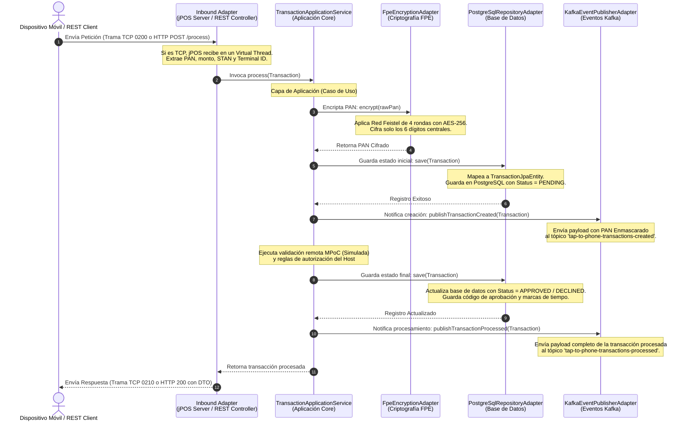

# 📖 Flujo Detallado de Ejecución y Simulación End-to-End (SoftPOS Backend)

Este documento detalla el flujo de ejecución completo, paso a paso, de la arquitectura **SoftPOS (Tap-to-Phone)**. Explica el ciclo de vida de una transacción (tanto vía HTTP REST como vía TCP ISO-8583), la interacción con la base de datos PostgreSQL, los tópicos de Apache Kafka y las simulaciones del validador de seguridad MPoC y del host financiero.

---

## 🏗️ 1. Estructura de Arquitectura Hexagonal

La aplicación está diseñada bajo el patrón de **Arquitectura Hexagonal (Puertos y Adaptadores)**, dividiendo el sistema en tres capas limpias:

```
                  ┌──────────────────────────────────────────────┐
                  │                 INFRASTRUCTURE               │
                  │  [Inbound Adapters]    [Outbound Adapters]   │
                  │  - JposServerAdapter   - FpeEncryptionAdapter│
                  │  - RestControllers     - KafkaEventPublisher │
                  │                        - PostgreSqlRepository│
                  └───────────────┬───────────────────▲──────────┘
                                  │ impl              │ impl
                  ┌───────────────▼───────────────────┼──────────┐
                  │                  APPLICATION                 │
                  │  [Inbound Ports]       [Outbound Ports]      │
                  │  - ProcessTxUseCase    - EventPublisherPort  │
                  │  - DeviceAttestUseCase - FpeEncryptionPort   │
                  │                        - TxRepositoryPort    │
                  │                                              │
                  │         [Service] TransactionAppService      │
                  └───────────────────────┬──────────────────────┘
                                          │ uses
                                  ┌───────▼───────┐
                                  │    DOMAIN     │
                                  │ - Transaction │
                                  │ - PAN         │
                                  │ - MPocAttest  │
                                  └───────────────┘
```

1. **Dominio (Domain)**: Modelos de negocio puros (`Transaction`, `PAN`, `MPocAttestation`). No dependen de frameworks.
2. **Aplicación (Application)**: Define los casos de uso (puertos de entrada) y las interfaces de comunicación con tecnologías externas (puertos de salida). `TransactionApplicationService` es el orquestador principal.
3. **Infraestructura (Infrastructure)**: Implementaciones tecnológicas concretas (adaptadores). Convierte protocolos (REST, TCP, JDBC, Kafka) a llamadas comprensibles por el dominio.

---

## 🔄 2. Diagrama de Secuencia End-to-End

El siguiente diagrama detalla la interacción cronológica de todos los componentes desde que ingresa una solicitud de transacción hasta que se retorna la respuesta:



---

## 📡 3. Análisis Detallado de los Endpoints REST

### 🔒 A. Atestación de Dispositivo Móvil
* **Endpoint**: `POST /api/v1/attestation/verify`
* **Clase**: [MPocRestController.java](file:///d:/Danny/Projects/Apex/Tap%20to%20Phone%201/taptotphone/src/main/java/danny/com/taptotphone/infrastructure/adapters/inbound/rest/MPocRestController.java)
* **Caso de Uso**: `DeviceAttestationUseCase.attestDevice`
* **Cuándo se llama**: Al abrir la aplicación móvil o iniciar la jornada de cobro diario.
* **Propósito**: Validar que el dispositivo comercial cumple con las especificaciones de seguridad de la norma PCI MPoC.
* **Flujo Interno**:
  1. El controlador recibe el identificador de la terminal, ID del hardware y el token de sesión de la emulación de tarjeta (`hceToken`).
  2. Invoca el servicio de aplicación, delegando en el puerto de salida `MPocAttestationPort`.
  3. **Simulación de Seguridad (`MpocAttestationAdapter.java`)**:
     * Simula una consulta HTTP externa al servidor de atestación de confianza en la nube (`taptotphone.mpoc.cloud-validation-url`).
     * Evalúa si el identificador del hardware contiene palabras clave sospechosas de vulneración como `"root"` o `"compromised"`.
     * Si no está comprometido, genera una firma digital simulada única (`-SECURE-MPOC-SIG`) y marca el dispositivo como `TRUSTED`.
  4. **Base de Datos**: Guarda el log histórico completo de la atestación en la tabla `mpoc_attestations` mediante JPA.
  5. Retorna la firma y el estatus para permitirle al SDK activar el lector NFC del celular.

---

### 💳 B. Procesamiento Manual de Transacciones
* **Endpoint**: `POST /api/v1/transactions/process`
* **Clase**: [TransactionRestController.java](file:///d:/Danny/Projects/Apex/Tap%20to%20Phone%201/taptotphone/src/main/java/danny/com/taptotphone/infrastructure/adapters/inbound/rest/TransactionRestController.java)
* **Caso de Uso**: `ProcessTransactionUseCase.process`
* **Cuándo se llama**: Para transacciones originadas mediante servicios web administrativos o para emulación manual de un cobro sin tarjeta física.
* **Propósito**: Iniciar un flujo completo de autorización y tokenización del PAN mediante API HTTP.
* **Flujo Interno**:
  1. Recibe los campos financieros en el cuerpo de la petición (`pan`, `amount`, `currency`, `terminalId`, `merchantId`, `stan`).
  2. **Validación de Tarjeta**: Instancia la clase de dominio `PAN.java`, la cual ejecuta automáticamente la validación del **Algoritmo de Luhn** (módulo 10). Si es inválido, detiene el flujo y retorna `HTTP 400 (INVALID_CARD)`.
  3. Ejecuta el ciclo de vida transaccional estándar y retorna la transacción procesada. El DTO de salida se encarga de enmascarar la tarjeta (ej. `411111******1111`) para cumplir con PCI DSS.

---

## 🔌 4. Flujo Principal TCP ISO-8583 (jPOS Server)

El motor principal de producción recibe peticiones TCP crudas generadas directamente por tarjetas contactless o billeteras electrónicas (Google Pay/Apple Pay).

### A. Gestión de Conexiones de Alta Concurrencia
* **Clase**: [JposServerAdapter.java](file:///d:/Danny/Projects/Apex/Tap%20to%20Phone%201/taptotphone/src/main/java/danny/com/taptotphone/infrastructure/adapters/inbound/jpos/JposServerAdapter.java)
* **Tecnología**: **jPOS 2.0.4** + Java 21 **Virtual Threads (Project Loom)**.
* **Inicialización**: Al arrancar Spring Boot, el adapter inicializa un servidor `ISOServer` escuchando en el puerto configurado (por defecto `6000`).
* **Ejecución en Hilos Virtuales**: El bucle de escucha del socket TCP se inicia en un hilo virtual ligero de Java (`Thread.startVirtualThread(isoServer::run)`). Esto elimina el cuello de botella tradicional de los modelos de hilos pesados del sistema operativo, permitiendo miles de conexiones de terminales móviles simultáneas.

### B. Recepción y Parseo de Mensajes
* Cuando llega un mensaje, el método `process(ISOSource source, ISOMsg msg)` se ejecuta de forma asíncrona en un **Virtual Thread individual** asignado exclusivamente a esa transacción.
* Se clona el mensaje entrante y se establece la respuesta en formato de salida (`response.setResponseMTI()`, transformando una trama `0200` a `0210`).
* Se extraen los campos de la trama ISO-8583:
  * **Field 2 o 35**: PAN de la tarjeta (si viene en el Track 2 de lectura NFC, se realiza el split usando el delimitador estándar `=` o `D`).
  * **Field 4**: Monto total. Viene representado en centavos a 12 caracteres (ej: `000000010050`). El adaptador lo convierte automáticamente a decimal (`100.50`).
  * **Field 11**: STAN (System Trace Audit Number).
  * **Field 41**: Terminal ID (utilizado en la red financiera como llave de enrutamiento).
  * **Field 42**: Merchant ID.
  * **Field 49**: Código de moneda ISO.
* Se instancia la transacción de dominio y se invoca la lógica central del servicio de aplicación.

---

## ⚙️ 5. Lógica del Ciclo de Vida de la Transacción

Independientemente del origen (REST o TCP), la ejecución de la lógica transaccional sigue un flujo unificado y riguroso dentro de [TransactionApplicationService.java](file:///d:/Danny/Projects/Apex/Tap%20to%20Phone%201/taptotphone/src/main/java/danny/com/taptotphone/application/service/TransactionApplicationService.java):

### 1. Encriptación FPE (Format-Preserving Encryption)
* **Clase**: [FpeEncryptionAdapter.java](file:///d:/Danny/Projects/Apex/Tap%20to%20Phone%201/taptotphone/src/main/java/danny/com/taptotphone/infrastructure/adapters/outbound/encryption/FpeEncryptionAdapter.java)
* **Propósito**: Cumplir con la norma PCI DSS tokenizando la tarjeta de forma reversible sin alterar la estructura del dato en la base de datos.
* **Mecánica del Algoritmo**:
  * Divide el PAN en 3 segmentos: los primeros 6 dígitos (BIN), los últimos 4 dígitos y los 6 dígitos centrales.
  * Los dígitos centrales se convierten en un entero en rango `[0, 999999]`.
  * Se procesan en una **Red Feistel de 4 rondas con Radix 1000** (split de izquierda y derecha de 3 dígitos `[0, 999]`).
  * La función de ronda utiliza cifrado simétrico **AES-256** en modo ECB y No Padding con una llave hexadecimal estática cargada desde la configuración.
  * Retorna los 6 dígitos cifrados integrados con el BIN y los últimos 4 originales.
  * *Ejemplo*: El PAN `4111112222223333` se convierte en `4111116035913333`.

### 2. Base de Datos - Estado Inicial (PostgreSQL)
* El puerto `PostgreSqlTransactionRepositoryAdapter.java` intercepta el objeto de dominio.
* Mapea los datos a `TransactionJpaEntity`.
* Guarda el registro en la tabla `transactions` con el estatus `PENDING`. El campo `encrypted_pan` almacena el PAN FPE y `masked_pan` la representación visual segura.

### 3. Kafka - Estado Inicial (Event Sourcing)
* El puerto `KafkaEventPublisherAdapter.java` publica un mensaje en el tópico `tap-to-phone-transactions-created`.
* **Seguridad**: El payload viaja exclusivamente con el PAN enmascarado para evitar filtraciones de tarjetas en sistemas de logs de Kafka.
* **Consumo**: Típicamente escuchado por microservicios de auditoría y análisis de fraude.

### 4. Simulación de Autorización y Host Financiero
* El backend simula las validaciones de las franquicias internacionales (Visa/Mastercard) y los bancos emisores:
  * **Fallo de Monto Inválido**: Si el monto es menor o igual a `0`, se declina la transacción con código de respuesta `13` (Invalid Amount).
  * **Fallo por Límite Contactless**: Si el monto supera los `$10,000.00` (límite máximo permitido para cobros rápidos Tap without PIN), se declina con código de respuesta `61` (Exceeds withdrawal limit).
  * **Aprobación Exitosa**: En cualquier otro rango de monto, se genera un código de autorización bancario aleatorio de 6 dígitos (ej: `829104`), marcando el estatus como `APPROVED` y código de respuesta `00` (Aprobado).

### 5. Finalización y Publicación de Eventos
* **Base de Datos**: Se actualiza el estado del registro a `APPROVED` o `DECLINED` con los respectivos códigos financieros y de auditoría.
* **Kafka**: Publica el resultado final en el tópico `tap-to-phone-transactions-processed`. El motor post-transaccional e interfaces de analítica consumen de aquí asíncronamente.
* **Respuesta**:
  * **REST**: Retorna el DTO limpio al controlador.
  * **TCP**: Inyecta los códigos financieros en los campos `38` (Auth Code) y `39` (Response Code) de la trama ISO-8583 `0210` y los envía de vuelta al socket TCP del celular comercial.
